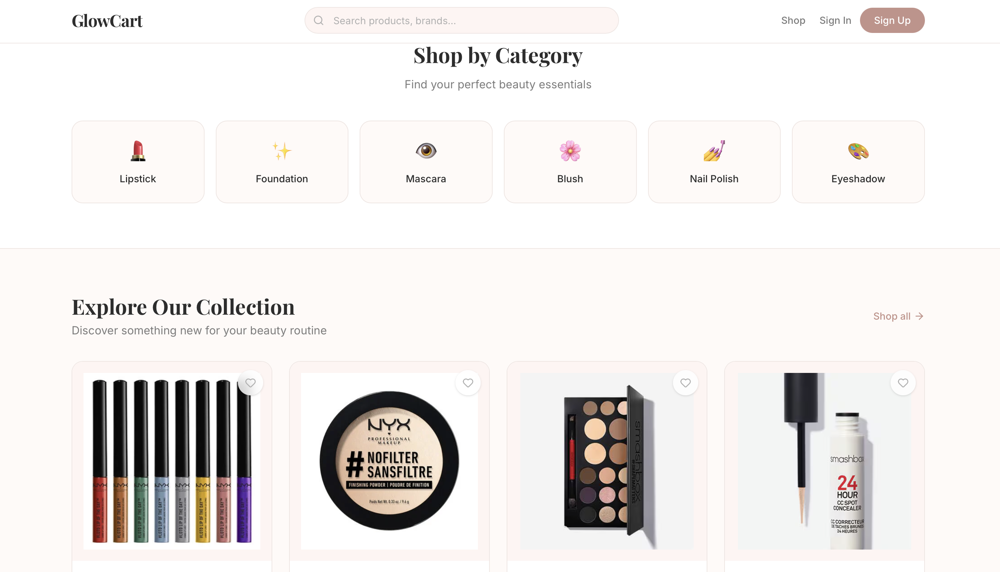
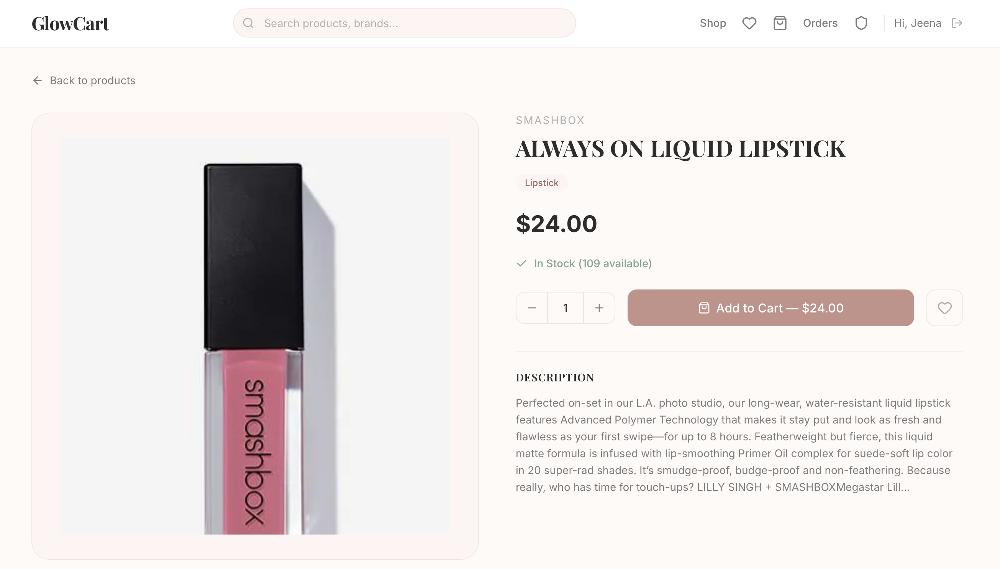
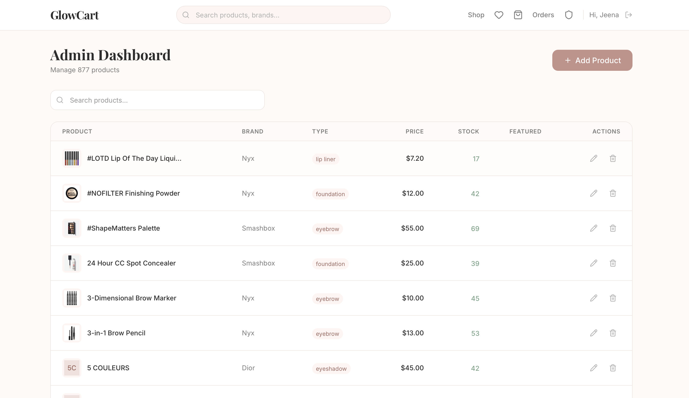
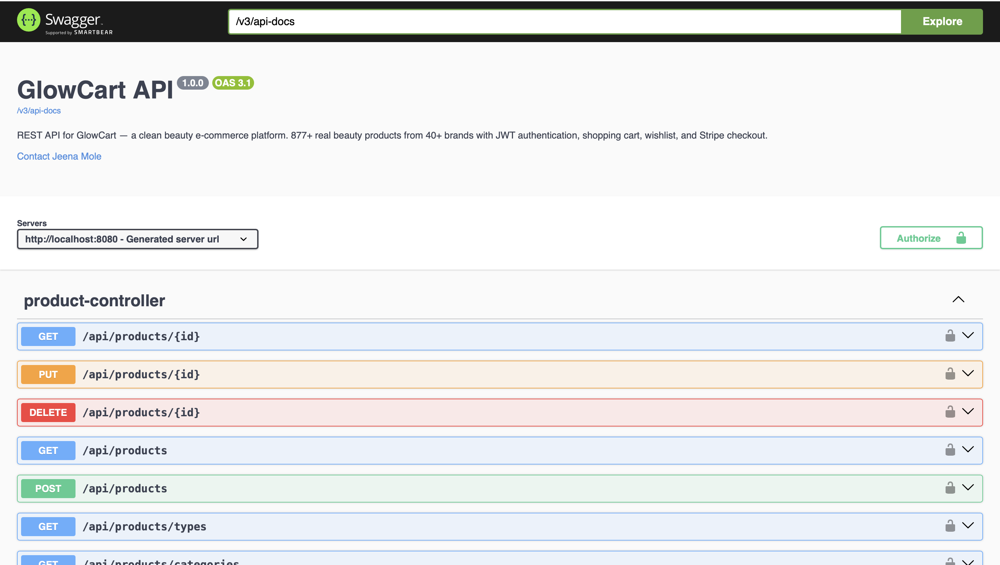

# ✨ GlowCart — Clean Beauty E-Commerce Platform

A full-stack, production-ready e-commerce platform for clean beauty products, built with **Spring Boot**, **React**, **PostgreSQL**, and **Stripe**. Containerized with **Docker** and orchestrated with **Kubernetes**.

> **877 real beauty products** from 40+ brands including Maybelline, NYX, Clinique, Fenty, Dior, and more — powered by the Makeup API.


## 🖥️ Screenshots

<table>
  <tr>
    <td><strong>Home Page</strong></td>
    <td><strong>Product Catalog</strong></td>
  </tr>
  <tr>
    <td></td>
    <td></td>
  </tr>
  <tr>
    <td><strong>Product Detail</strong></td>
    <td><strong>Admin Dashboard</strong></td>
  </tr>
  <tr>
    <td></td>
    <td></td>
  </tr>
  <tr>
    <td colspan="2"><strong>Swagger API Documentation</strong></td>
  </tr>
  <tr>
    <td colspan="2"></td>
  </tr>
</table>
---

## 🏗️ Architecture

```
┌─────────────────────────────────────────────────────────────────┐
│                        KUBERNETES CLUSTER                       │
│  ┌───────────────────────────────────────────────────────────┐  │
│  │                     INGRESS (nginx)                       │  │
│  │              /api/* → backend    /* → frontend             │  │
│  └──────────┬──────────────────────────────┬─────────────────┘  │
│             │                              │                    │
│  ┌──────────▼──────────┐    ┌──────────────▼────────────────┐  │
│  │   BACKEND SERVICE   │    │     FRONTEND SERVICE          │  │
│  │   (ClusterIP:8080)  │    │     (ClusterIP:80)            │  │
│  └──────────┬──────────┘    └───────────────────────────────┘  │
│             │                                                   │
│  ┌──────────▼──────────┐    ┌───────────────────────────────┐  │
│  │  Spring Boot (×2)   │    │   React + Nginx (×2)          │  │
│  │  ┌───────────────┐  │    │   ┌────────────────────────┐  │  │
│  │  │ REST API      │  │    │   │ Product Catalog        │  │  │
│  │  │ JWT Auth      │  │    │   │ Shopping Cart          │  │  │
│  │  │ Business Logic│  │    │   │ Checkout Flow          │  │  │
│  │  │ Stripe SDK    │  │    │   │ Admin Dashboard        │  │  │
│  │  └───────────────┘  │    │   └────────────────────────┘  │  │
│  │  HPA: 2-5 replicas  │    └───────────────────────────────┘  │
│  └──────────┬──────────┘                                        │
│             │                                                   │
│  ┌──────────▼──────────┐    ┌───────────────────────────────┐  │
│  │ POSTGRES SERVICE    │    │        STRIPE API             │  │
│  │ (ClusterIP:5432)    │    │   (External Payment Gateway)  │  │
│  └──────────┬──────────┘    └───────────────────────────────┘  │
│             │                                                   │
│  ┌──────────▼──────────┐                                        │
│  │  PostgreSQL (×1)    │                                        │
│  │  StatefulSet        │                                        │
│  │  PVC: 5Gi           │                                        │
│  └─────────────────────┘                                        │
│                                                                 │
│  ConfigMap ─── Non-sensitive config (DB URL, JWT expiration)    │
│  Secret ────── Sensitive data (DB password, Stripe key, JWT)    │
└─────────────────────────────────────────────────────────────────┘
```

---

## 🛠️ Tech Stack

### Backend
| Technology | Purpose |
|---|---|
| Java 17 | Language |
| Spring Boot 3.5 | REST API framework |
| Spring Security | JWT authentication & role-based access |
| Spring Data JPA | ORM with Hibernate |
| PostgreSQL 17 | Relational database |
| Stripe Java SDK | Payment processing |
| Maven | Build tool |
| Lombok | Boilerplate reduction |

### Frontend
| Technology | Purpose |
|---|---|
| React 19 | UI framework |
| Vite | Build tool |
| Tailwind CSS v4 | Utility-first styling |
| React Router | Client-side routing |
| Axios | HTTP client with interceptors |
| Lucide React | Icon library |
| Stripe.js | Payment integration |

### DevOps & Deployment
| Technology | Purpose |
|---|---|
| Docker | Multi-stage containerization |
| Docker Compose | Local multi-service orchestration |
| Kubernetes | Production orchestration |
| Nginx | Frontend serving & API reverse proxy |

---

## ✅ Features

### Customer Features
- Browse 877+ real beauty products with images, prices, and descriptions
- Search products with live autocomplete suggestions
- Filter by brand (40+), product type, and category
- Sort by name, price, or rating
- Paginated product catalog (20 items per page)
- Product detail pages with descriptions, ingredients, and stock info
- Shopping cart with quantity controls and stock validation
- Wishlist with heart toggle functionality
- Secure checkout with Stripe PaymentIntent integration
- Order history with detailed order view
- JWT-based authentication (register/login)

### Admin Features
- Product management dashboard (Create, Read, Update, Delete)
- Searchable product table with pagination
- Edit product details, pricing, stock, and featured status
- Role-based access control (CUSTOMER vs ADMIN)

### Technical Features
- Stateless JWT authentication with BCrypt password hashing
- Global exception handling with consistent error responses
- Real product data seeded from Makeup API on first startup
- Idempotent data seeder (skips if products exist)
- BigDecimal for precise monetary calculations
- Lazy loading with FetchType.LAZY on all relationships
- Database indexes on frequently queried columns
- Historical price snapshots in order items
- CORS configuration for cross-origin requests
- Environment variable configuration for all secrets
- Docker multi-stage builds for optimized images
- Kubernetes manifests with health probes and auto-scaling

---

## 🚀 Getting Started

### Prerequisites
- Java 17+
- Node.js 18+
- PostgreSQL 17
- Maven (or use included wrapper `./mvnw`)

### Option 1: Run Locally

**1. Clone the repository**
```bash
git clone https://github.com/jeena-krishna/glowcart.git
cd glowcart
```

**2. Set up PostgreSQL**
```bash
psql postgres
CREATE USER glowcart_user WITH PASSWORD 'glowcart_pass';
CREATE DATABASE glowcart_db OWNER glowcart_user;
GRANT ALL PRIVILEGES ON DATABASE glowcart_db TO glowcart_user;
\q
```

**3. Start the backend**
```bash
cd backend
export STRIPE_SECRET_KEY=your_stripe_test_secret_key
./mvnw spring-boot:run
```
The backend starts at `http://localhost:8080`. On first run, it seeds 877 products from the Makeup API.

**4. Start the frontend**
```bash
cd frontend
npm install
npm run dev
```
The frontend starts at `http://localhost:5173`.

### Option 2: Run with Docker Compose

```bash
# Create .env file with your Stripe key
echo "STRIPE_SECRET_KEY=your_stripe_test_key" > .env

# Build and start all services
docker compose up --build
```
The app is available at `http://localhost:3000`.

### Option 3: Deploy to Kubernetes

```bash
# Build Docker images
docker compose build

# Deploy to cluster
./k8s/deploy.sh

# Check status
kubectl get pods -n glowcart

# Teardown
./k8s/teardown.sh
```

---

## 📁 Project Structure

```
glowcart/
├── backend/
│   ├── src/main/java/com/glowcart/backend/
│   │   ├── config/          # Security, CORS, Stripe configuration
│   │   ├── controller/      # REST API endpoints
│   │   ├── dto/             # Request/Response data transfer objects
│   │   ├── entity/          # JPA entities (database tables)
│   │   ├── exception/       # Custom exceptions & global handler
│   │   ├── mapper/          # Entity ↔ DTO converters
│   │   ├── repository/      # Spring Data JPA repositories
│   │   ├── security/        # JWT service & auth filter
│   │   ├── seeder/          # Makeup API data seeder
│   │   └── service/         # Business logic layer
│   ├── Dockerfile           # Multi-stage Java build
│   └── pom.xml
├── frontend/
│   ├── src/
│   │   ├── api/             # Axios client & API service functions
│   │   ├── components/      # Reusable UI components
│   │   ├── context/         # Auth & Cart React contexts
│   │   └── pages/           # Route-level page components
│   ├── Dockerfile           # Multi-stage Node + Nginx build
│   ├── nginx.conf           # Nginx reverse proxy config
│   └── package.json
├── k8s/
│   ├── namespace.yaml       # Resource isolation
│   ├── configmap.yaml       # Non-sensitive configuration
│   ├── secrets.yaml         # Sensitive credentials
│   ├── ingress.yaml         # L7 traffic routing
│   ├── deploy.sh            # One-command deployment
│   ├── teardown.sh          # Clean removal
│   ├── postgres/
│   │   ├── pvc.yaml         # 5Gi persistent storage
│   │   ├── statefulset.yaml # Database with health probes
│   │   └── service.yaml     # Internal ClusterIP service
│   ├── backend/
│   │   ├── deployment.yaml  # 2 replicas, rolling updates
│   │   ├── service.yaml     # Internal ClusterIP service
│   │   └── hpa.yaml         # Auto-scale 2→5 on CPU/memory
│   └── frontend/
│       ├── deployment.yaml  # 2 replicas, rolling updates
│       └── service.yaml     # Internal ClusterIP service
├── docker-compose.yml       # Full-stack local deployment
└── README.md
```

---

## 🔌 API Endpoints

### Authentication
| Method | Endpoint | Description | Auth |
|--------|----------|-------------|------|
| POST | `/api/auth/register` | Register new user | Public |
| POST | `/api/auth/login` | Login & receive JWT | Public |
| GET | `/api/auth/me` | Get current user profile | Required |

### Products
| Method | Endpoint | Description | Auth |
|--------|----------|-------------|------|
| GET | `/api/products` | List products (paginated, filterable) | Public |
| GET | `/api/products/{id}` | Get product details | Public |
| GET | `/api/products/brands` | List all brands | Public |
| GET | `/api/products/types` | List all product types | Public |
| GET | `/api/products/categories` | List all categories | Public |
| POST | `/api/products` | Create product | Admin |
| PUT | `/api/products/{id}` | Update product | Admin |
| DELETE | `/api/products/{id}` | Delete product | Admin |

### Cart
| Method | Endpoint | Description | Auth |
|--------|----------|-------------|------|
| GET | `/api/cart` | Get user's cart | Required |
| POST | `/api/cart` | Add item to cart | Required |
| PUT | `/api/cart/{productId}?quantity=N` | Update item quantity | Required |
| DELETE | `/api/cart/{productId}` | Remove item from cart | Required |
| DELETE | `/api/cart` | Clear entire cart | Required |
| GET | `/api/cart/count` | Get cart item count | Required |

### Wishlist
| Method | Endpoint | Description | Auth |
|--------|----------|-------------|------|
| GET | `/api/wishlist` | Get wishlisted products | Required |
| POST | `/api/wishlist/{productId}` | Toggle wishlist (add/remove) | Required |
| DELETE | `/api/wishlist/{productId}` | Remove from wishlist | Required |
| GET | `/api/wishlist/{productId}/check` | Check if wishlisted | Required |

### Orders
| Method | Endpoint | Description | Auth |
|--------|----------|-------------|------|
| POST | `/api/orders/checkout` | Create order + Stripe PaymentIntent | Required |
| POST | `/api/orders/{id}/confirm` | Confirm payment | Required |
| GET | `/api/orders` | List user's orders (paginated) | Required |
| GET | `/api/orders/{id}` | Get order details | Required |

### Webhooks
| Method | Endpoint | Description | Auth |
|--------|----------|-------------|------|
| POST | `/api/webhooks/stripe` | Handle Stripe payment events | Public (Stripe signature verified) |

---

## 🗄️ Database Schema

```
users ──────────┐
  id (PK)       │
  first_name    ├──< cart_items (user_id FK)
  last_name     │      product_id FK ──> products
  email (UQ)    │      quantity
  password      │
  role          ├──< orders (user_id FK)
  created_at    │      total_amount
  updated_at    │      status
                │      stripe_payment_intent_id
                │      └──< order_items (order_id FK)
                │             product_id FK ──> products
                │             quantity
                │             price_at_purchase
                │             product_name (snapshot)
                │
                └──< wishlist_items (user_id FK)
                       product_id FK ──> products

products ───────
  id (PK)
  name
  brand (IDX)
  price
  description
  product_type (IDX)
  category (IDX)
  image_url
  stock_quantity
  featured
  rating
```

---

## 🔐 Security

- **JWT tokens** for stateless authentication (24h expiration)
- **BCrypt** password hashing with random salt
- **Role-based access control** — CUSTOMER and ADMIN roles
- **Non-root Docker containers** for defense in depth
- **Environment variables** for all secrets (never hardcoded)
- **Stripe signature verification** on webhooks
- **CORS** configured for allowed origins only
- **Input validation** with Jakarta Bean Validation
- **SQL injection prevention** via parameterized JPA queries

---

## 🐳 Docker Details

**Backend image** — Multi-stage build: Maven compiles the JAR in stage 1, JRE-only image runs it in stage 2. Final image contains no source code or build tools.

**Frontend image** — Multi-stage build: Node builds the React app in stage 1, Nginx serves the static files in stage 2. Gzip compression and cache headers configured.

**Docker Compose** — Orchestrates PostgreSQL, backend, and frontend with health check dependencies, named volumes for data persistence, and bridge networking for inter-service communication.

---

## ☸️ Kubernetes Details

| Resource | What & Why |
|---|---|
| **Namespace** | Isolates GlowCart resources from other cluster workloads |
| **ConfigMap** | Externalizes non-sensitive config (DB URL, JWT expiration) |
| **Secret** | Stores sensitive data (passwords, API keys) separately |
| **StatefulSet** | PostgreSQL with stable identity and persistent storage |
| **PVC (5Gi)** | Database data survives pod restarts and rescheduling |
| **Deployment (backend ×2)** | Replicated API servers with rolling updates |
| **Deployment (frontend ×2)** | Replicated Nginx servers with rolling updates |
| **HPA** | Auto-scales backend 2→5 pods on 70% CPU / 80% memory |
| **Startup Probe** | Gives Java app 120s to start before marking unhealthy |
| **Readiness Probe** | Checks `/api/health` before routing traffic to pod |
| **Liveness Probe** | Restarts pod if `/api/health` fails 3 consecutive times |
| **Ingress** | L7 routing: `/api/*` → backend, `/*` → frontend |
| **Resource Limits** | CPU/memory requests and limits prevent resource starvation |

---

## 👤 Demo Accounts

| Role | Email | Password |
|------|-------|----------|
| Admin | jeena@glowcart.com | password123 |
| Customer | Register via the sign-up page | — |

---

## 🙋‍♀️ Author

**Jeena Mole** — Software Engineer

- [LinkedIn](https://linkedin.com/in/jeena-mole)
- [GitHub](https://github.com/jeena-krishna)

---

## 📄 License

This project is built for educational and portfolio purposes.
Product data sourced from the [Makeup API](http://makeup-api.herokuapp.com/) (open source).
